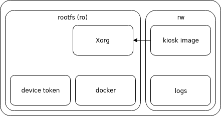
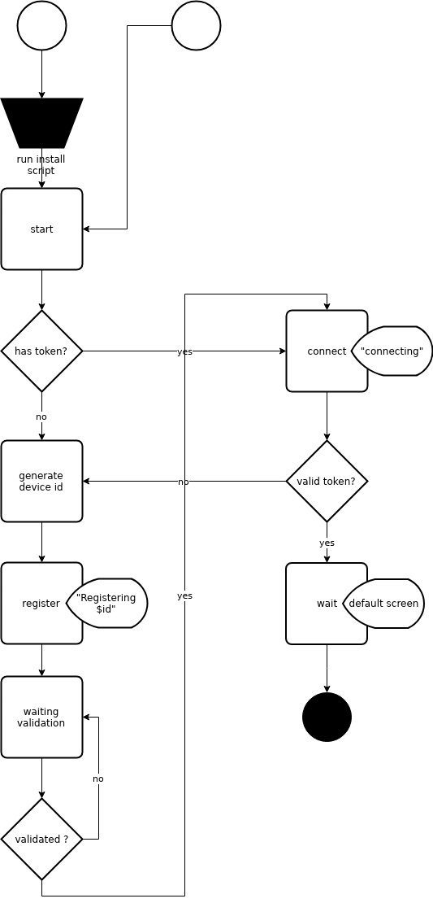

Kiosk is a powerful way to display dashboard on TV using linux devices.

# Why ?

There are some challenge in displaying dashboard

## Security

**Authentication**

Some dashboard are accessible without authentication from the office either by using IP restriction or being in the same private local network. Some tools (like datadog) allow to generate a publicly accessible link for the purpose of dashboard.

But you also need to handle authentication for many others tools and its a tedious task to connect to the device using VNC to login.

**Trojan**

Deploying a stanadlone device into the workspace brings security issue. They have to be secured and up to date. Most of the time they are considered as an appliance and forgotten, hidden behind the TV screen

No need to say that storing credentials on the device is a bad option with security in mind.

## Relevance

Creating dashboard is hard and creating usefull dashboard is harder. The hardest thing is to fight the "dashboard fatigue". If your dashboard is always displayed without relevant information, you will end up by just ignoring it. Better display weather forecast or the last quote from the *#jokes* slack channel.

Kiosk aims to display the right dashboard at the rignt time by subscribing to events like monitoring alerts, release, ...

# How ?

//TODO C1 diagram

## Target devices
* raspberry pi 3 running raspian strech

# Getting starting

## Start test browser
vagrant up

## Device architecture

## Device boot sequence
